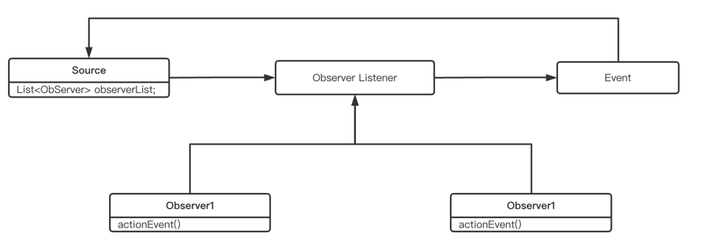

# designMode
1. 推荐代码规范书籍：
   1. 代码整洁之道
   2. 代码大全
   3. 编写可读性代码的艺术
2. 设计模式的分类：
   1. 创建型模式(5种)：提供创建对象的机制，提升已有代码的灵活性和可复用行
      常用：单例模式、工厂模式(工厂方法和抽象工厂)、创建者模式
      不常用：原型模式
   2. 结构型模式(7种)：介绍如何将对象和类组装成较大的结构，并同时保持结构的灵活和高效
      常用：代理模式、桥接模式、装饰者模式、适配器模式
      不常用：外观模式、组合模式、享元模式
   3. 行为模式(11种)：负责对象间的高效沟通和职责传递委派
      常用：观察者模式、模板模式、策略模式、责任链模式、迭代器模式、状态模式
      不常用：访问者模式、备忘录模式、命令模式、解释器模式、中介模式
3. 设计原则
   1. 单一职责原则：一个类只负责完成一个职责或功能
   2. 开闭原则：
      1. 对扩展开放，修改关闭
      2. 开闭原则是所有设计模式的核心目标
      [在开发设计时应该具有抽象意识、封装意识和扩展意识，对之后代码的重构或扩展留有余地]()
   3. 里氏替换原则
      1. 多态特性
      2. 如果一个方法的参数是接口，则这个方法可以接收所有实现参数中接口的实现类
   4. 接口隔离原则
      1. 一个类对另一个类的依赖应该建立在最小的接口上(比如说多个实现类实现了同一个接口，其中的一个实现类想要实现某个功能，
          如果在接口中直接添加要实现的功能方法，则其他实现类也需要实现该方法，正确的做法是单独写一个接口实现该方法，然后让需要该方法的实现类实现新的接口) 
      2. 将粒度较大的接口分解成多个粒度小的接口，提高系统的灵活性和可维护性
      3. 使用多个专门的接口，能够体现出对象的层次
      4. 减少项目中冗余的代码
   5. 依赖倒置原则
      1. 程序依赖于抽象而不再依赖于具体的实现
      2. 依赖倒置、控制反转、依赖注入
         1. 依赖倒置是一种通用设计模式，主要用来指导框架层面的设计
         2. 控制反转是一种框架设计常用的模式，但是不是具体的方法，是一种抽象的思想
         3. 依赖注入是实现控制反转的手段，是一种具体的编码技巧
   6. 迪米特法则
      1. 最少知道原则
      2. 一个实体尽可能少的与其他实体发生相互作用
4. 设计模式实现
   1. 单例模式
   2. 工厂模式
      1. 接口工厂模式
         1. 接口工厂模式为一个接口多个实现，最常见的就是开发过程中Service和Impl
      2. 抽象工厂模式
         1. 抽象工厂模式更倾向于将一整个产品进行包装使用
   3. 原型模式
      1. 前端比较常用
      2. 原型模式使用需要在具体的类里实现一个克隆方法（clone()）
      3. 原型模式用一个已经创建的实例作为原型，通过复制该原型来创建一个和原型对象相同的新对象
      4. 浅克隆
         1. 克隆对象中的所有变量的值与原型对象的值完全相同（引用数据类型变量中存储的地址也是完全一致的）
      5. 深克隆
         1. 克隆对象的所有基本数据类型变量含有的值与原型对象完全一致（不包含引用数据类型）
   4. 代理模式
      1. 代理模式分为静态代理和动态代理两种方式
      2. 静态代理和动态代理区别
         1. 静态代理在编译时就已经实现了，编译完成后代理类是一个实际的class文件
         2. 如何接口增加了一个方法，静态代理模式除了所有的实现类要实现这个方法之外，所有的代理类也都需要实现这个方法，
            会形成很多不必要的代码，增加代码复杂度
         3. 动态代理是在运行时动态生成的，即编译完成后没有实际的class文件，而是在运行时动态生成字节码，并加载到JVM中
      3. JDK动态代理和cglib动态代理区别
         1. JDK动态代理需要类实现一个或多个接口
         2. cglib是基于ASM字节码工具操作字节码
         3. cglib不能对声明为final的类或者方法进行代理，cglib原理是动态生成代理类的子类
         4. jdk1.8之后的版本，JDK代理效率高于cglib，有接口使用JDK动态代理，没有接口使用cglib代理
      4. 代理模式可以用在接口调用时的增强，或者执行sql时候的日志记录等
      5. 开发中比较常见的代理有@Around()，@Before，@After等，可以通过execution(...)或者@annotation(...)制定切入的类
   5. 桥接模式
      1. 桥接模式将两个独立变化的维度进行了解耦
      2. 桥接模式包含了四个角色：
         1. 抽象化角色：定义抽象类，并包含了一个对实现化对象的引用
         2. 扩展抽象化角色：是抽象化角色的子类，实现父类中的业务方法，并通过组合关系调用实现化角色中的业务方法
         3. 实现化角色：定义实现化角色的接口，供扩展抽象化角色调用
         4. 具体实现化角色：给出实现化角色接口的具体实现
   6. 装饰者模式
      1. 动态的给一个对象添加一些额外的方法（职责）
      2. 装饰者模式包含了四个角色：
         1. Component（抽象构件）：抽象构件可以是一个类或抽象接口，是最原始的对象
         2. ConcreteComponent（具体构件）：是Component的实现类或子类，可以单独使用也可以对其进行装饰
         3. Decorator（装饰角色）：一般是抽象类，一般继承Component类或实现Component接口，有一个属性指向Component抽象构件
         4. ConcreteDecorator（具体抽象角色）：可以对基本构件进行装饰
   7. 适配器模式
      1. 将类的接口转换为客户期望的另一个接口，适配器可以让不兼容的两个类一起协同工作
      2. 分为接口适配者类和对象适配者类
   8. 享元模式
      1. 摒弃了每个对象中存储所有数据的形式，通过共享多个对象所共有的相同形态，从而让我们能在有限的内存容器中载入更多的对象
      2. 在JAVA中，享元模式一个常用的场景是，使用数据类的包装类对象的valueOf()方法
   9. 观察者模式
      1. 观察者模式一般分为事件源、事件以及监听者三个对象
      2. 观察者模式一般同责任链模式一起使用
      3. 观察者模式可以监听某个事件的发生，并且发生之后完成特定的方法
      4. Spring Aop也可以理解为一个观察者模式
         事件图：
   10. 模版模式
       1. 模版方法可以实现反向的控制结构，通过子类覆盖父类的钩子方法来决定某一个特定步骤是否需要执行
       2. 父类的抽象方法由子类实现，子类执行的结果会影响父类的结构，导致一种反向的控制结构，提高了代码的阅读难度
   11. 策略模式
       1. 策略模式封装的是每个方法不同的执行方式
   12. 责任链模式
       1. 责任链模式一般在过滤器链比较常用，可以做一下敏感词过滤等操作
   13. 状态模式
       1. 允许一个对象在其内部状态改变时改变它的行为，对象看起来似乎修改了它的类
       2. 解决系统中复杂对象的状态转换以及不同状态下行为的封装问题，状态模式将一个对象的状态从该对象中分离出来封装到专门的状态类中
   14. 迭代器模式
       1. 又称游标模式，原始定义是：迭代器提供一种对容器对象中的各个元素进行访问的方法，又不需要暴露该对象的内部细节
   

   

